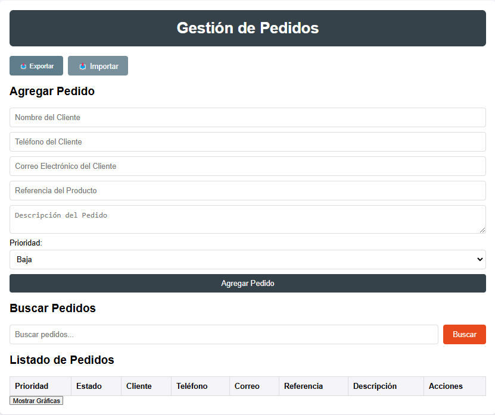

# Gestión de Pedidos

Una aplicación web ligera y funcional para gestionar pedidos de forma local. Diseñada para pequeñas empresas o individuos, esta herramienta permite agregar, buscar, visualizar y exportar pedidos de manera fácil e intuitiva.

## 🚀 Características

- **Gestión de Pedidos**: Captura datos clave como nombre del cliente, teléfono, correo electrónico, referencia del producto y descripción.
- **Búsqueda Inteligente**: Filtra pedidos por cualquier campo, ya sea en tiempo real o mediante un botón.
- **Exportación de Pedidos**: Genera notas en formato PDF con los detalles del pedido para compartir o archivar.
- **Visualización de Datos**: Gráficas interactivas que muestran los productos más solicitados.
- **Persistencia de Datos**: Utiliza `localStorage` para mantener los pedidos incluso al recargar la página. Exportación / Importación 
- **Diseño Moderno**: Interfaz limpia, responsiva y fácil de usar.

## 🛠️ Tecnologías Utilizadas

- **HTML5**: Estructura del proyecto.
- **CSS3**: Diseño y estilos visuales.
- **JavaScript**: Lógica de la aplicación.
- **Chart.js**: Gráficas interactivas.
- **jsPDF**: Exportación de pedidos en formato PDF.

## 🌟 Capturas de Pantalla

### Vista Principal


## 🔧 Cómo Usar

1. **Clona el Repositorio**:
   ```bash
   git clone https://github.com/omrpps/pedidos.git
   cd pedidos
